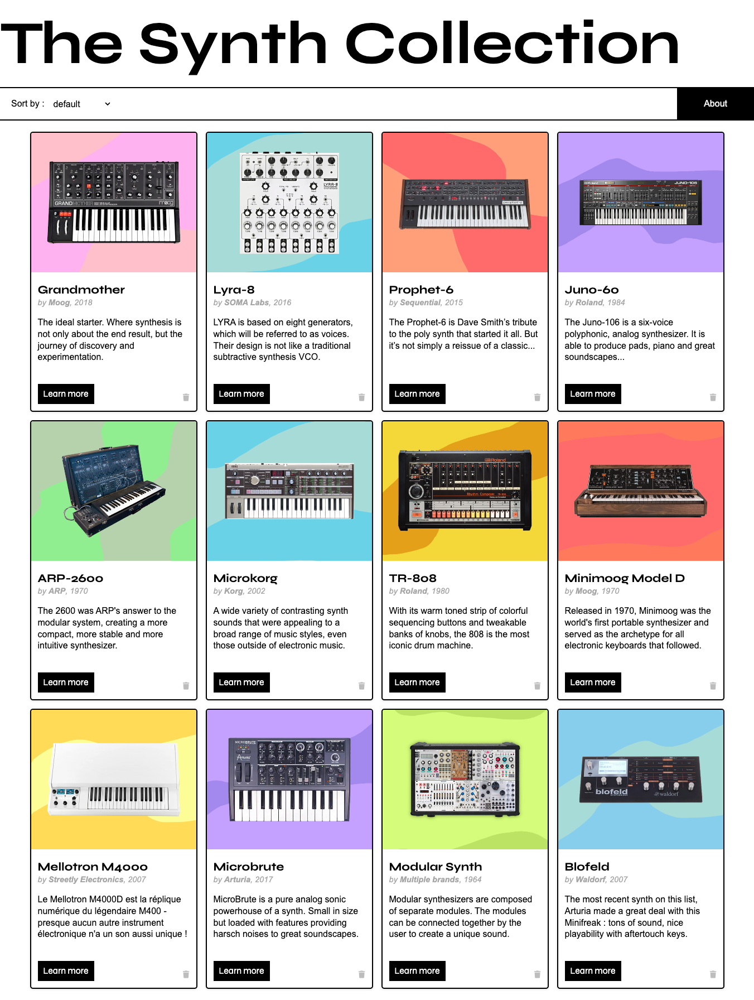

# The Collection

- Type of Challenge: `consolidation`
- Duration: `2 days`
- Team challenge: `Solo`

## The challenge

The goal of this project will be to summarize our current knowledge of :

- HTML and CSS
- Responsive design
- Javascript Basics
- The DOM

to create of collection of objects. You'll have to create a card for each object with javascript and populate it with the properties from that same object. **BONUS :** add a delete button, a sorting function and some animations.

## &#9749; Final output :

https://antoinel74.github.io/TheCollection/

